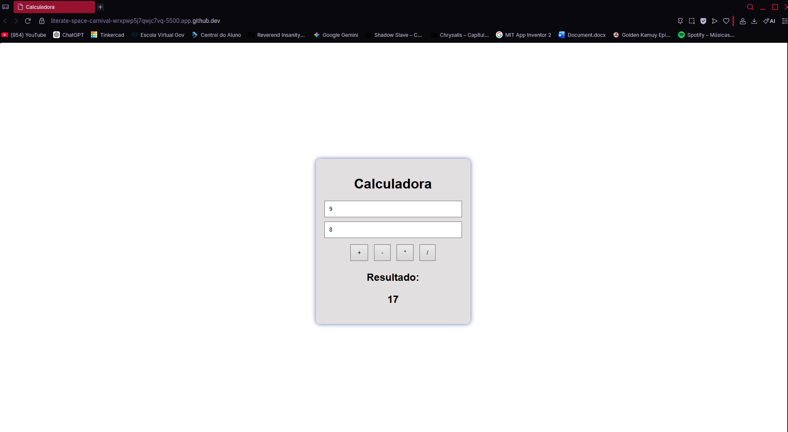
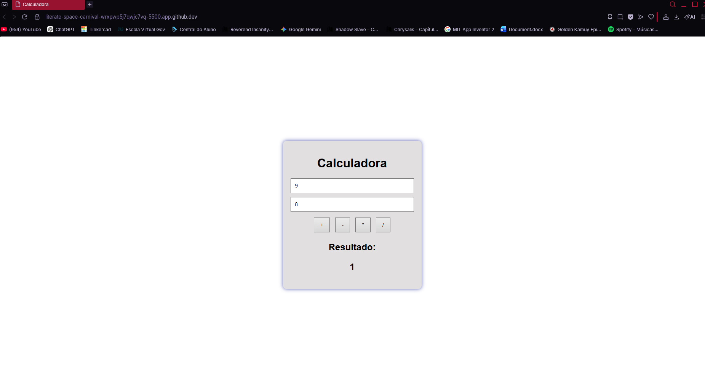
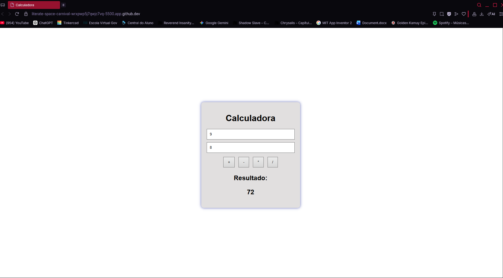
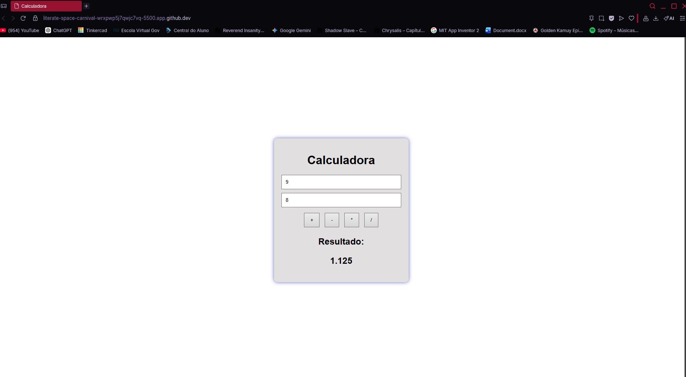

# Calculadora-Uninove
Atividade valendo nota, criação de uma calculadora

Descrição do Projeto - Calculadora Simples

Este projeto consiste em uma calculadora simples desenvolvida utilizando HTML, CSS e JavaScript. O objetivo foi criar uma interface básica capaz de realizar as quatro operações matemáticas fundamentais: soma, subtração, multiplicação e divisão.

A estrutura da página foi criada com HTML, contendo dois campos de texto para a entrada dos números e quatro botões, cada um responsável por uma operação matemática. O CSS foi utilizado para organizar os elementos e dar uma aparência simples e agradável à calculadora.

A lógica das operações foi implementada em JavaScript. Ao inserir dois números e clicar em um dos botões, o programa realiza o cálculo correspondente e exibe o resultado. Para cada operação, foi utilizada uma expressão matemática adequada, como adição, subtração, multiplicação ou divisão.

Soma

A operação de soma é utilizada para adicionar dois valores. O programa recebe os números informados pelo usuário e calcula o resultado através da expressão n1 + n2.

Subtração

A operação de subtração é utilizada para calcular a diferença entre dois valores. O resultado é obtido pela expressão n1 - n2.

Multiplicação

A operação de multiplicação é utilizada para calcular o produto entre dois números. O cálculo é realizado pela expressão n1 * n2.

Divisão

A operação de divisão é utilizada para determinar quantas vezes um número está contido em outro. O resultado é calculado pela expressão n1 / n2.
